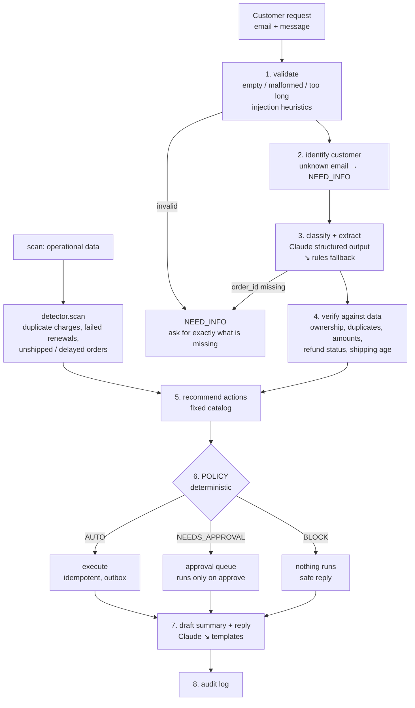

# Brewly Ops Agent: operations automation with guardrails

AI Demo Challenge, **Option 3: Operations Automation Agent**.

A small agent for a fictional DTC coffee brand ("Brewly"). It reads customer-support requests, or scans
operational data, works out what the problem is, **checks the claim against real data**, recommends next
actions, and then either executes them, queues them for **human approval**, or **blocks** them.

```
"I was charged twice for order O123!"
  → understood: duplicate_charge, order O123          (Claude, or rules fallback)
  → verified:   P1001 $34.00 10:02 + P1002 $34.00 10:05 (from payments data)
  → decided:    refund $34 ≤ $50 limit → AUTO; ticket → AUTO; Slack #billing → AUTO
  → executed:   R-0001, T-0001, M-0001, reply email E-0001
```

## Core idea: the LLM proposes, the code decides

The LLM is used only for language: classifying intent, extracting entities, and drafting text.
Everything with consequences is plain, deterministic Python: checking facts, choosing actions, and
deciding whether an action may run without a human.

Why:
- **Testable.** The guardrails are pure functions. They have unit tests that run offline in under a second.
- **Safe against prompt injection.** The model cannot take actions, and money amounts come from our
  records, never from the message or the model.
- **Explainable.** Every decision carries human-readable reasons and is written to an audit log.

## Architecture



| Module | Responsibility | Uses LLM? |
|---|---|---|
| `validate.py` | input checks, prompt-injection heuristics, which intents need an order ID | no |
| `classifier.py` | `RuleClassifier` (EN+VI regex), `ClaudeClassifier` (structured output), `FallbackClassifier` | yes, optional |
| `detector.py` | `verify()` per intent, `scan()` over the data | no |
| `recommend.py` | map a verified situation to actions from a fixed catalog | no |
| `policy.py` | **guardrails**: per-action tier plus an overall tier with reasons | no |
| `executor.py` | simulated side effects (refund, ticket, Slack, email, cancel), idempotent | no |
| `approvals.py` | human-in-the-loop queue, persisted as events | no |
| `drafter.py` | internal summary and customer reply (Claude or templates) | yes, optional |
| `pipeline.py` | wires the steps together and writes the audit trail | no |
| `outbox.py` | append-only JSONL standing in for Zendesk, Slack, Stripe and email | no |

## Guardrail policy

| Tier | When | Behaviour |
|---|---|---|
| 🟢 `AUTO` | status replies, tickets, Slack notifications, **verified refunds ≤ $50** | runs immediately and is audited |
| 🟡 `NEEDS_APPROVAL` | refunds > $50, subscription cancellation, intent unclear, confidence < 0.7, **suspected prompt injection**, any action without a rule (default deny) | queued; runs only after `approve` |
| 🔴 `BLOCK` | order not found, **order belongs to another customer**, claimed amount > amount paid, already refunded, no active subscription | nothing runs; the customer gets a safe reply |
| ❓ `NEED_INFO` | empty or malformed input, unknown email, missing order ID | asks for exactly the missing field; **never guesses** |

Limits live in `policy.py` (`AUTO_REFUND_LIMIT = 50.00`, `MIN_CONFIDENCE = 0.7`).

## Key design decisions

1. **A workflow, not an autonomous agent.** The steps are fixed and known in advance, so a deterministic
   pipeline with two narrow LLM calls is cheaper, faster and easier to test than letting a model loop
   over tools. Where to go next is in [Production roadmap](#production-roadmap).
2. **Never trust the claim; verify against data.** "Charged twice" is checked against payments. Refund
   amounts come from the order record. A claim of "$500" on a $45 order is blocked, not negotiated.
3. **Don't let the LLM hallucinate identifiers.** If Claude returns an order ID that does not appear in
   the message text, it is dropped and the customer is asked for it.
4. **Treat customer text as data.** It is fenced in `<customer_message>` tags and the model is told never
   to follow instructions inside it. A regex heuristic plus the model's own flag send suspicious
   messages to a human. Even if both miss, the model has no way to trigger an action.
5. **Don't leak other customers' data.** A request about someone else's order gets the same reply as a
   non-existent order.
6. **Idempotency everywhere.** Refunds are keyed `refund:{order}:{payment}`, and tickets and Slack
   messages are de-duplicated. Repeating a request or re-running `scan` never refunds twice or spams
   channels. An approval executes exactly once.
7. **Graceful degradation.** Without an API key the agent runs on rules and templates. If Claude
   errors, that one request falls back. A permanent error such as an invalid key opens a circuit
   breaker, so the process stops calling the API.
8. **Deterministic time.** A fixed reference clock (`OPSAGENT_NOW`) keeps rules like "shipped more than
   7 days ago" reproducible in tests.
9. **State = seed data + replayed events.** The outbox is an append-only log. The CLI and the API rebuild
   the same state from it, and `/reset` restores the seed.

## How to run

Requirements: [uv](https://docs.astral.sh/uv/). It installs Python 3.12 and the dependencies.

```bash
uv sync
uv run pytest                      # 121 tests, offline, no API key needed
uv run opsagent eval               # 20 end-to-end scenarios → pass/fail table
```

CLI:

```bash
uv run opsagent handle --email anna@example.com --message "I was charged twice for order O123!"
uv run opsagent handle --email chloe@example.com --message "I want a refund for order O789."
uv run opsagent approvals list
uv run opsagent approvals approve A-0001 --note "checked photo of broken kettle"
uv run opsagent scan
uv run opsagent reset              # restore seed state
```

API with Swagger UI (it has ready-made request examples in a dropdown):

```bash
uv run opsagent serve              # http://localhost:8000/docs
```

| Endpoint | Purpose |
|---|---|
| `POST /requests` | handle one request `{customer_email, message}` |
| `POST /scan` | proactive scan of the data |
| `GET /approvals?status=pending` | approval queue |
| `POST /approvals/{id}/approve` · `/reject` | human decision `{reviewer, note}` |
| `GET /audit`, `GET /outbox/{stream}` | audit trail; simulated tickets, Slack messages, emails and refunds |
| `POST /reset`, `GET /health` | demo helpers (`/health` shows whether Claude or rules is active) |

### Using Claude

```bash
export ANTHROPIC_API_KEY=sk-ant-...
export OPSAGENT_MODEL=claude-opus-5-5   # default; claude-haiku-4-5 is ~10x cheaper for this task
uv run opsagent check-llm               # one call: key, base URL, served model, structured output
uv run opsagent eval --live             # same 20 scenarios through Claude, no fallback (~$0.5 on Opus)
uv run pytest -m live
```

An Anthropic-compatible gateway also works: set `ANTHROPIC_BASE_URL` and check it with `check-llm`
first. Gateways differ in which models they offer and in whether they pass structured outputs through.

`OPSAGENT_LLM=auto|claude|off` selects the mode. `auto` (the default) uses Claude when credentials exist
and rules otherwise.

## Testing strategy

| Layer | What | Cost |
|---|---|---|
| Unit tests | validation, rule classifier, detector, **policy**, executor idempotency, approvals, API | free, offline |
| Scenario eval (`evals/scenarios.yaml`) | 20 end-to-end cases: happy paths, missing data, unknown customer, another customer's order, amount mismatch, already refunded, prompt injection, Vietnamese input, repeated request, scan | free, offline |
| Live eval (`--live`, `-m live`) | the same scenarios with Claude doing the classification | a few cents to ~$0.5 |

The safety properties are tested deterministically and are independent of the model. The live eval
measures something different: how well the model understands messages.

## Mock data

`data/*.json`: 4 customers, 9 orders, 11 payments and 3 subscriptions. Each record is seeded for a
scenario. Examples: a real duplicate charge (O123), a refund large enough to need approval (O789), an
already-refunded order (O321), a delayed shipment (O654), a failed subscription renewal (S2), and a
decoy (O658: a failed payment followed by a successful retry, which must **not** be flagged as a
duplicate). Details are in [`docs/spec.md`](docs/spec.md).

## Known limitations

- Rule-based classification is keyword-driven: one intent per message, and confidence is a fixed 0.8
  or 0.3. It is a safety net, not a replacement for the LLM.
- Template replies are English only. Claude replies in the customer's language when it is enabled.
- **The live Claude path is verified against the SDK's request/response shapes (including a local fake
  server), but it has not been benchmarked with a real key in this repo yet.** Run `opsagent eval --live`.
- Single turn: there is no conversation memory. A follow-up message with the missing order ID is a new request.
- No refund windows, partial refunds, multi-order requests or currency handling.
- The customer's email stands in for authentication.
- JSONL plus in-process state, so a single process only. The API serialises requests with a lock.
- After an approval is decided, no follow-up email is sent to the customer.

## Production roadmap

- **Real integrations** behind the same `Executor` interface: Stripe refunds with Stripe idempotency
  keys, Zendesk or Linear tickets, Slack, and email. Use the outbox pattern with a worker and retries.
- **Persistence and concurrency**: Postgres for cases, approvals and the event log, plus a queue for
  incoming requests.
- **Approval UX**: Slack interactive buttons or an internal console, with approval roles and limits per
  role (agent ≤ $50, lead ≤ $500), SLA timers, and a notification to the customer after the decision.
- **Policy as config** with versioning, so every decision records which policy version made it.
- **Evaluation**: a larger labelled set sampled from real tickets, live eval in CI on prompt or model
  changes, tracking of classifier precision and recall, and tracking of the human override rate (a key
  signal for tuning limits).
- **Observability**: tracing per case, LLM latency, cost and fallback-rate dashboards, and alerts when
  the circuit breaker opens.
- **Agentic investigation where it pays off**: let the model call *read-only* tools (order history,
  carrier tracking) for ambiguous cases, while keeping the policy gate deterministic.
- **Security**: authenticated channels instead of trusting the email field, PII redaction in logs, and
  rate limits per customer.

## Project layout

```
data/                  mock operational data
evals/scenarios.yaml   scenario suite (offline + live)
docs/spec.md           design spec
docs/plan.md           implementation plan
docs/loom-script.md    demo video script
src/opsagent/          the agent (see module table above)
tests/                 unit, scenario and API tests
```
